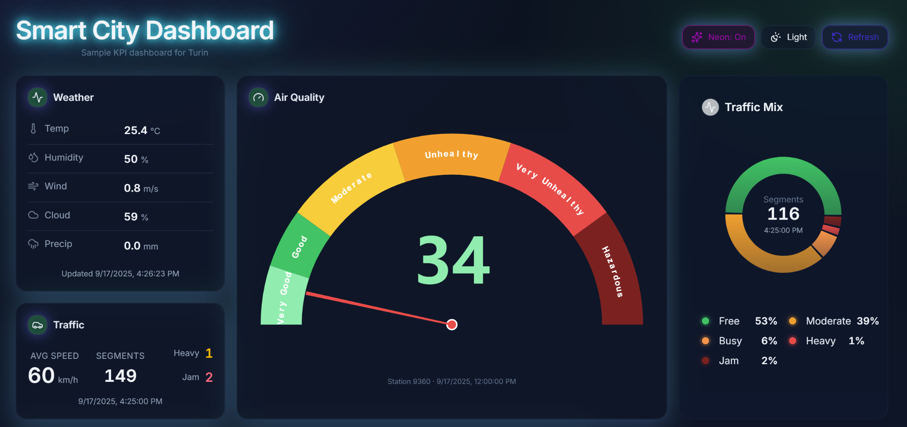
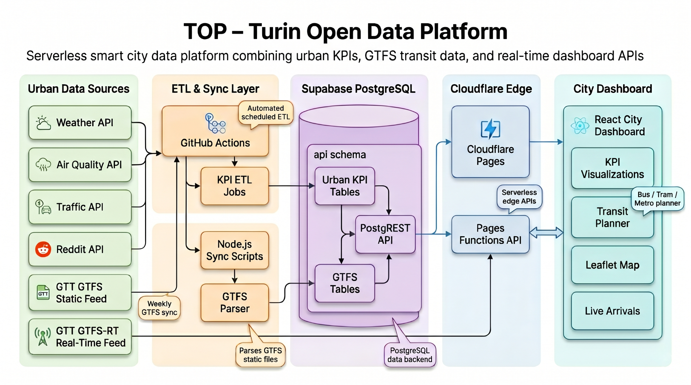
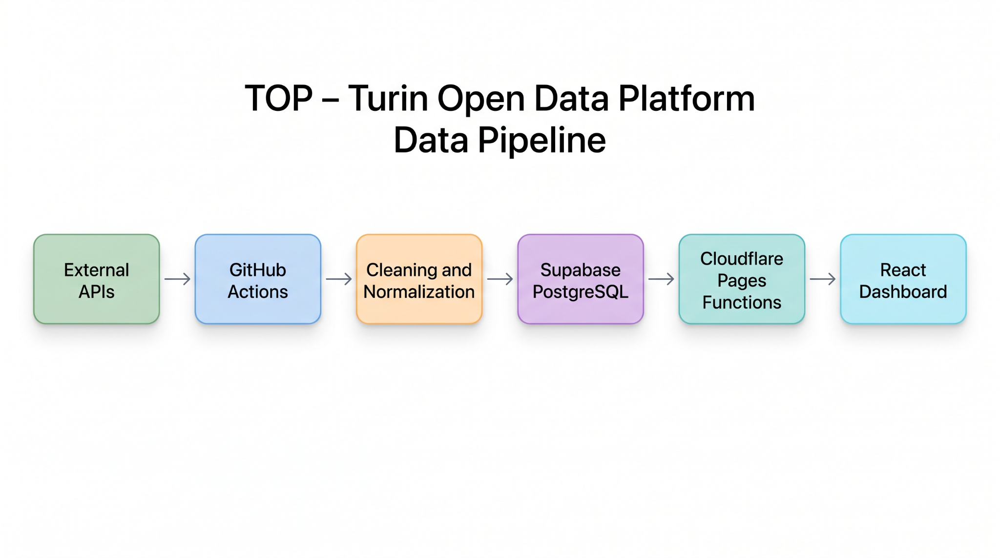
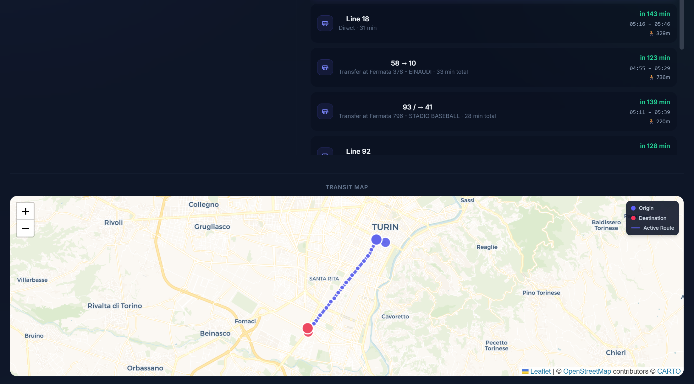
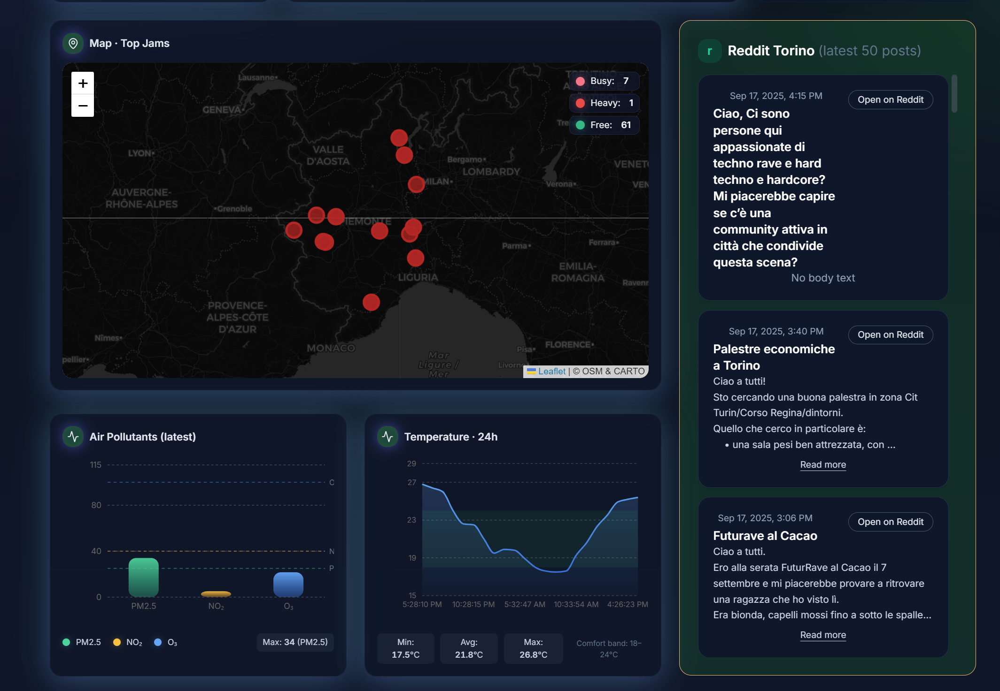

# **TOP – Turin Open Data Platform**

> **A near real-time smart city data platform for Turin, Italy — turning open urban data into live KPIs, public transport intelligence, GTFS-based routing, and interactive city dashboards.**

[](https://github.com/NavidTavakoli/TOP-turin-open-data-platform/actions/workflows/cron-etl.yml)
[](https://github.com/NavidTavakoli/TOP-turin-open-data-platform/actions/workflows/cron-reddit.yml)
[](https://github.com/NavidTavakoli/TOP-turin-open-data-platform/actions/workflows/cron-purge-traffic.yml)
[](https://github.com/NavidTavakoli/TOP-turin-open-data-platform/actions/workflows/cron-purge-env.yml)


**Live Demo:** [navidtavakolishalmani.com/city-dashboard](https://navidtavakolishalmani.com/city-dashboard)

---

## **Preview**



---

## **Overview**

**TOP – Turin Open Data Platform** is an end-to-end **smart city data engineering and dashboard project** focused on Turin, Italy.

The platform collects urban data from multiple public sources, normalizes it, stores it in **Supabase PostgreSQL**, serves it through **Cloudflare Pages Functions**, and visualizes the results in a **React dashboard**.

It combines:

- live weather indicators
- air quality KPIs
- road traffic and congestion metrics
- Reddit community signals from r/Torino
- GTT public transport data
- GTFS static schedules
- GTFS-RT real-time transit updates
- a custom transit planner with direct and one-transfer route options

The project is designed as a portfolio-grade example of how **data engineering**, **serverless APIs**, **geospatial reasoning**, and **frontend visualization** can work together in a real smart city product.

---

## **System Architecture**



The architecture separates the platform into five main layers:

1. **Urban Data Sources** — Weather, air quality, traffic, Reddit, GTFS static, and GTFS-RT feeds.
2. **ETL & Sync Layer** — GitHub Actions and Node.js scripts automate ingestion, cleaning, GTFS parsing, and scheduled updates.
3. **Supabase PostgreSQL** — Central data backend using the `api` schema, KPI tables, GTFS tables, and PostgREST.
4. **Cloudflare Edge** — Cloudflare Pages serves the frontend, while Pages Functions provide serverless API endpoints.
5. **City Dashboard** — React dashboard for KPI visualizations, transit planning, maps, and live arrivals.

---

## **Data Pipeline**




This flow represents the core KPI pipeline. Transit routing adds an additional GTFS sync path where static GTFS files are parsed and stored in PostgreSQL, while GTFS-RT is consumed at request time by the serverless API layer.

---

## **Demo Screenshots**

### **Dashboard Overview**


### **Transit Planner and Route Map**



### **Urban Insights, Traffic, Air Quality, Temperature, and Reddit Feed**



---

## **Core Features**

### **1. Smart City KPI Dashboard**

The dashboard provides a live overview of Turin through urban KPIs:

- weather conditions
- air quality status
- traffic congestion
- road segment statistics
- temperature trends
- pollutant indicators
- community posts from r/Torino

The goal is to make fragmented city data understandable through a single interactive interface.

---

### **2. GTT Public Transit Planner**

The transit planner is one of the most complex parts of the project.

Since GTT does not provide a public route-planning API, the planner is built directly on top of:

- GTFS static schedules
- GTFS stop sequences
- GTFS shapes
- stop-to-line mappings
- GTFS-RT live trip updates
- walking-distance calculations between stops

It supports:

- direct routes
- one-transfer routes
- bus, tram, and metro lines
- walking transfers between nearby stops or stations
- schedule-aware route generation
- route ranking by duration, waiting time, walking distance, and route quality
- interactive route visualization on Leaflet maps

The planner can generate Google-like options such as direct routes, metro-to-bus transfers, bus-to-bus transfers, and walking transfers between nearby stations and stops.

It also filters weak results such as repeated chains, same-line transfers, tiny feeder rides, and routes that are much worse than available direct alternatives.

---

### **3. Live Stop Arrivals**

Users can search for GTT stops by name or code and view upcoming arrivals.

The live arrivals feature uses:

- stop lookup
- nearby stop search
- static schedules
- live GTFS-RT updates
- fallback logic when real-time data is unavailable

This makes the platform useful both as an analytics dashboard and as a practical transit tool.

---

### **4. Traffic Flow KPIs**

Traffic data is transformed into mobility indicators such as:

- average road speed
- number of monitored segments
- free / moderate / busy / heavy / jam categories
- top traffic jams
- congestion severity distribution

The dashboard visualizes both city-level traffic conditions and localized congestion points.

---

### **5. Air Quality Monitoring**

The platform tracks air quality indicators such as:

- AQI score
- PM2.5
- PM10
- NO₂
- O₃
- SO₂
- CO

The frontend uses gauge and chart visualizations to present environmental status in a readable way.

---

### **6. Weather KPIs**

Weather data is collected and visualized as live environmental context.

Included metrics:

- temperature
- humidity
- wind speed
- precipitation
- cloud cover
- 24-hour temperature trends

---

### **7. Reddit Torino Feed**

The dashboard includes recent posts from **r/Torino** to represent a lightweight social signal layer.

This helps surface local discussions, mobility complaints, community questions, city events, and emerging local topics.

---

## **Engineering Highlights**

- Built a custom GTFS-based public transport planner without relying on a third-party routing API.
- Supports direct and one-transfer routes across bus, tram, and metro services.
- Handles walking transfers between nearby stops and stations, not just exact same-stop transfers.
- Combines static GTFS schedules with GTFS-RT live updates.
- Uses schedule-aware candidate generation and route scoring.
- Filters low-quality transit candidates before returning final results.
- Enriches route legs with stop sequences and shape geometry for map rendering.
- Uses Supabase PostgreSQL as a structured urban data backend.
- Uses Cloudflare Pages Functions as a serverless API layer.
- Uses GitHub Actions for scheduled ETL, purge jobs, and GTFS sync workflows.
- Demonstrates a complete data product lifecycle from ingestion to dashboard visualization.

---

## **Data Sources**

| Domain | Source | Purpose |
|---|---|---|
| Public transport | GTT GTFS static feed | Stops, lines, schedules, trips, stop sequences, and shapes |
| Real-time transit | GTT GTFS-RT feed | Live trip updates and delay information |
| Weather | Open-Meteo API | Current and historical weather metrics |
| Air quality | WAQI API | AQI and pollutant indicators |
| Traffic | 5T Piemonte API | Road speed, congestion, and traffic flow |
| Community signals | Reddit r/Torino | Local posts and citizen discussion signals |

---

## **Transit Planner – How It Works**

Given an origin and destination coordinate pair, the planner:

1. Finds nearby origin and destination stops.
2. Detects which GTT lines serve those stops.
3. Builds direct route candidates from trips connecting origin-side stops to destination-side stops.
4. Builds one-transfer candidates using valid transfer pairs.
5. Allows walking transfers between nearby stops or stations.
6. Filters schedules by departure window and active service day.
7. Rejects same-line transfers such as `42 → 42`.
8. Scores routes using duration, walking distance, transfer waiting time, and line diversity.
9. Deduplicates repeated route chains.
10. Removes weak or unrealistic candidates.
11. Enriches the result with stop sequences and map geometry.
12. Returns a user-friendly list of direct and one-transfer options.

---

## **Route Quality Filtering**

Raw GTFS routing can produce technically valid but poor user experiences. The planner therefore filters out:

- same-line transfers
- duplicate route chains
- repeated later departures of the same weak option
- very short feeder rides followed by long waits
- transfer routes that are worse than an available direct line
- excessive walking transfers
- routes with poor total duration compared with alternatives

This makes the final output closer to what users expect from a real-world transit planner.

---

## **GTFS Data Model**

The project stores GTFS-derived data in Supabase under the `api` schema.

| Table | Purpose |
|---|---|
| `gtt_stops` | Stop metadata and coordinates |
| `gtt_stop_lines` | Mapping between stops and served lines |
| `gtt_stop_schedules` | Compact JSONB schedule entries per stop |
| `gtt_trip_stop_sequences` | Ordered stop sequences per trip |
| `gtt_shapes` | GTFS shape geometry for map rendering |
| `gtt_calendar` | Regular service calendar |
| `gtt_calendar_dates` | Service exceptions |

---

## **ETL and Automation Workflows**

All scheduled jobs are managed by GitHub Actions.

| Workflow | Purpose |
|---|---|
| `cron-etl.yml` | Fetches weather, air quality, traffic, and other KPI data |
| `cron-reddit.yml` | Collects recent Reddit posts from r/Torino |
| `cron-purge-traffic.yml` | Removes stale traffic records |
| `cron-purge-env.yml` | Removes outdated environmental records |
| GTFS sync workflow | Updates GTT static transit data |

---

## **Tech Stack**

| Layer | Technology |
|---|---|
| Frontend | React, Vite, Tailwind CSS |
| Maps | Leaflet, react-leaflet |
| Charts | Apache ECharts, Recharts |
| Animation | Framer Motion |
| Backend API | Cloudflare Pages Functions, TypeScript |
| Database | Supabase PostgreSQL, PostgREST, `api` schema |
| ETL / Sync | Node.js scripts, GitHub Actions |
| Transit | GTFS static feed, GTFS-RT real-time feed |
| Deployment | Cloudflare Pages |
| Version Control | GitHub |

---

## **Repository Structure**

```text
TOP-turin-open-data-platform/
├── .github/workflows/ # GitHub Actions for ETL pipelines and CRON jobs
├── functions/         # Cloudflare Workers serverless API endpoints (Backend)
├── images/            # Architecture diagrams and dashboard screenshots
├── scripts/           # Local Node.js utilities (e.g., GTFS data sync)
├── src/               # React (Vite) frontend application source code
├── package.json       # Project dependencies and configuration
└── README.md          # Project documentation
```
---

## **Why This Project Matters**

Smart cities need more than open data. They need systems that transform raw feeds into reliable, understandable, and actionable indicators.

This project shows how a city can move from disconnected data sources to an integrated urban intelligence layer.

Potential use cases:

- **City planners** can monitor mobility and congestion patterns.
- **Transport authorities** can analyze public transport accessibility and service quality.
- **Environmental teams** can track weather and pollution conditions.
- **Researchers** can use integrated city datasets for modeling and analysis.
- **Citizens** can access useful real-time information in a single interface.

---

## **Portfolio Value**

This project demonstrates practical skills across the full data engineering lifecycle:

- API ingestion
- ETL automation
- PostgreSQL modeling
- GTFS schedule processing
- geospatial reasoning
- serverless API development
- frontend data visualization
- production deployment
- debugging real cloud issues
- route ranking and data-quality filtering

It is not only a dashboard; it is an end-to-end urban data product.

---

## **Roadmap**

Planned improvements:

- Add more detailed historical KPI trends.
- Improve GTFS-RT delay integration in the route planner.
- Add route comparison metrics for public transport options.
- Add sentiment analysis for Reddit posts.
- Add congestion heatmaps.
- Add more open datasets such as energy, bike sharing, and parking.
- Add documentation for database schema setup.

---

## **Acknowledgements**

- Supabase for PostgreSQL hosting and PostgREST APIs
- Cloudflare Pages for edge deployment
- GitHub Actions for automation
- Open-Meteo for weather data
- WAQI for air quality data
- 5T Piemonte for traffic data
- GTT for GTFS and GTFS-RT public transport data
- OpenStreetMap contributors for map data

---

## **License**

This project is distributed under the **MIT License**. See the license file for details.

---

Produced by **[Navid Tavakoli Shalmani](https://navidtavakolishalmani.com/)**

*This project is under active development.*
