[Readme.md](https://github.com/user-attachments/files/22389341/Readme.md)
# **TOP – Turin Open Data Platform**

*A Demo of near real-time urban data platform highlighting the importance of KPIs in smart cities*

## About the Project

**Turin Open Data Platform (TOP)** is a real-world prototype of a **smart city KPI dashboard**. It is a project designed to demonstrate how **Key Performance Indicators (KPIs)** can empower smart cities. By collecting, cleaning, and visualizing near real-time data from multiple sources, this platform provides valuable insights into the urban environment of **Turin, Italy**.

The platform integrates diverse datasets—including **weather**, **air quality**, **traffic conditions**, and even **citizen opinions from Reddit**—to build a unified city dashboard. The goal is to highlight how open data and automation can support decision-making, sustainability, and better quality of life in modern urban ecosystems and smart cities.

## 🌍 Data Sources

The platform integrates multiple APIs into a single PostgreSQL database hosted on **Supabase**:

- **🌦️ Weather (Open-Meteo API)**
   Current meteorological conditions for Turin (temperature, humidity, wind, precipitation, etc.).
- **🏭 Air Quality (WAQI API – Lingotto station)**
   Near air quality index (AQI) and pollutants such as PM2.5, PM10, O₃, NO₂, SO₂.
- **🚦 Traffic Flow (5T Piemonte API)**
   Road speed and flow indicators across the Piemonte region, categorized into congestion levels (free, moderate, busy, heavy, jam).
- **💬 Reddit /r/Torino**
   The last 50 posts from the local Reddit community.

## ✨ Features

- 🌦 **Weather Data** – Fetches real-time weather information for Turin.
- 🌫 **Air Quality Monitoring** – Tracks pollution and atmospheric conditions across the city.
- 🚦 **Traffic Data** – Collects mobility and congestion information from the Piedmont region.
- 💬 **Citizen Voices** – Gathers the latest Reddit posts about Turin to reflect community sentiment.
- ⚡ **Automated Data Pipeline** – Uses **GitHub Actions** to fetch, clean, and load data into a cloud-hosted PostgreSQL database (**Supabase**).
- 📊 **Real-Time Dashboard** – Interactive city dashboard that visualizes KPIs for Turin in near real-time.

## ⚙️ Automation with GitHub Actions

All data collection and maintenance tasks are fully automated using **GitHub Actions**, scheduled via CRON.
 Workflows are located under `.github/workflows`:

- **`cron-etl.yml`** → ETL pipelines that fetch data from external APIs and insert them into Supabase.
- **`cron-rollup.yml`** → Weekly rollup & cleanup for weather data.
- **`cron-purge-traffic.yml`** → Bi-daily purge of old traffic data to keep the database lean.
- **`cron-reddit.yml`** → Fetches and stores the latest 50 community posts every 3 hours.

These pipelines ensure that the database remains **fresh, lightweight, and near real-time oriented**.

## 🗄️ Database Design

- **Supabase (PostgreSQL)** hosts the structured tables (`weather_current`, `air_quality_current`, `traffic_flow_current`, `reddit_torino_posts`).

- **Views** provide higher-level KPIs (e.g., city-wide traffic congestion summary).

- **Row Level Security (RLS)** + policies ensure that external clients can only **read** public-facing data.

  

## 🖥 City Dashboard

The [City Dashboard](https://navidtavakolishalmani.com/city-dashboard )  presents all integrated datasets in a user-friendly, graphical format.

- Weather and air quality indexes update in real-time.
- Traffic congestion is tracked continuously.
- Reddit feeds showcase live community perspectives.

This dashboard illustrates how **data-driven insights** can help policymakers, researchers, and citizens better understand urban dynamics.

## 🛠 Tech Stack

- **Backend / Data Pipeline**: GitHub Actions, Python, APIs
- **Database**: Supabase (PostgreSQL)
- **Frontend**: Web-based City Dashboard (JavaScript, HTML, CSS, Charts)
- **Visualization**: Graphs & real-time charts for KPIs

```mermaid
flowchart TD
    subgraph DataSources[🌍 Data Sources]
        A1["🌦️ Weather"]
        A2["🏭 Air Quality"]
        A3["🚦 Traffic Flow"]
        A4["💬Society"]
    end

    subgraph ETL[⚙️ ETL & Automation]
        B1["⏱️ GitHub Actions"]
    end

    subgraph Database[🗄️ Supabase]
        C1["(PostgreSQL DB)"]
        C2["PostgREST REST API"]
    end

    subgraph Dashboard[📊 City Dashboard]
        D1["Dashboard"]
        D2["Visualizations"]
    end

    A1 --> B1
    A2 --> B1
    A3 --> B1
    A4 --> B1

    B1 --> C1
    C1 --> C2
    C2 --> D1
    D1 --> D2

    %% ---------- Styles ----------
    classDef rounded fill:#f9f9f9,stroke:#333,stroke-width:1px,rx:20,ry:20
    class A1,A2,A3,A4,B1,C1,C2,D1,D2 rounded

 
    style DataSources fill:#FFFFFF,stroke:#00BF63,stroke-width:2px,rx:25,ry:25
    style ETL fill:#FFBD59,stroke:#FF914D,rx:25,ry:25
    style Database fill:#0097B2,rx:25,ry:25
    style Dashboard fill:#00BF63,rx:25,ry:25

```

## 🌍 Why This Project Matters

This project showcases the **importance of KPIs** in smart cities:

- Monitoring **environmental health** (air & weather).
- Managing **urban mobility** (traffic).
- Understanding **citizen engagement** (social media).
- Creating **data transparency** and **evidence-based policies**.

By automating open data collection and presenting it through a clear dashboard, **TOP** can inspire scalable applications for other cities worldwide.

## 🎯 Next Steps

- Add KPIs for **energy consumption and renewables** (Terna).
- Integrate **public transport real-time** (GTT GTFS-RT).
- Explore **social sentiment analysis** from Reddit posts.
- Expand dashboard visualizations (pie charts, heatmaps, congestion maps).

## 🤝 Contributing

Contributions are welcome! Please fork the repository and submit a pull request.

## 🙌 Acknowledgements

- Supabase for managed PostgreSQL
- GitHub Actions for CI/CD workflows
- Open APIs providing weather, air quality, and traffic data

